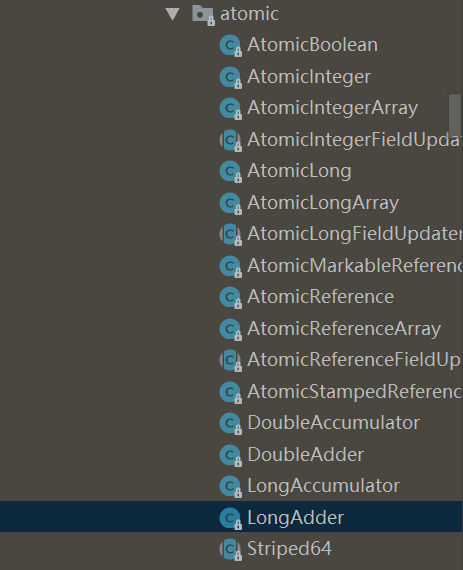

# Java高并发编程

## 基本概念

### 并发：

同时拥有两个或者多个线程，如果程序在单核处理器上运行，多个线程将交替地换入或者换出内存，这些线程是同时"存在"的，每个线程都处于执行过程中的某个状态，如果运行在多核处理器上，此时，程序中的每个线程都将分配到一个处理器核上，因此可以同时运行

### 高并发：

是互联网分布式系统架构设计中必须考虑的因素之一，它通常是指，通过设计保证系统能够同时并行处理很多请求

## 并发编程基础


## 线程安全性

#### 定义：

当多个线程访问某个类时，不管运行时环境采用何种调度方式或者这些进程将如何交替执行，并且在主调代码中不需要任何额外的同步或协同，这个类都能表现出正确的行为，那么就称这个类时线程安全的。

#### 线程安全性：

原子性：提供了互斥访问，同一时刻只能有一个线程来对它进行操作

​	涉及到jdk的  Atomic包

##### AtomicXXX: CAS、Unsafe.compareAndSwapInt

```java
count.incrementAndGet();

public class AtomicInteger extends Number implements java.io.Serializable {
  /**
     * Atomically increments by one the current value.
     *
     * @return the updated value
     */
    public final int incrementAndGet() {
        return unsafe.getAndAddInt(this, valueOffset, 1) + 1;
    }
}


public final class Unsafe {
  
  	/**
  	*  var1  当前对象，即调用对象 count
  	*  var2  当前值，例如2+1  当前值为  2
  	*  var4  增加量
  	**/
      public final int getAndAddInt(Object var1, long var2, int var4) {
        int var5;
        do {
            var5 = this.getIntVolatile(var1, var2);
        } while(!this.compareAndSwapInt(var1, var2, var5, var5 + var4));

        return var5;
    }
  
}
```

​	（2）AtomicLong、LongAdder

| AtomicLong                              | LongAdder                    |
| --------------------------------------- | ---------------------------- |
|                                         | 在统计的时候如果有并发更新，可能会导致统计的数据有误差  |
| 如果在序列号生成或者要求很精确的情况下，必须使用全局唯一的AtomicLong | 高并发性能比AtomicLong强            |
| 在线程竞争很低的情况使用AtomicLong更简单，效率更高一些        | 在实际处理中在高并发状态下可以优先使用LongAdder |

 

AtomicReference、AtomicReferenceFieldUpdater

##### AtomicStampReference: CAS的ABA问题

ABA问题：

​	当一个线程要操作某个变量时，首先拿到该变量值为A当这个线程对该变量进行操作时，另一个线程拿到该变量并将该变量值修改为B后，又修改回了A。这时第一个线程回来发现这个变量的值还是A没有改变，所以做了其他操作。

​	解决办法：当第一个线程拿到该变量时为其设置版本号1，第二个线程将变量A改为B时，变量版本号变为2，当第二个线程将变量由B改为A的时候，变量版本变为3。当第一个线程回来时发现版本号不是1则表示变量已经被修改

```java
public class AtomicStampedReference<V> {
  /**
     * Atomically sets the value of both the reference and stamp
     * to the given update values if the
     * current reference is {@code ==} to the expected reference
     * and the current stamp is equal to the expected stamp.
     *
     * @param expectedReference the expected value of the reference
     * @param newReference the new value for the reference
     * @param expectedStamp the expected value of the stamp
     * @param newStamp the new value for the stamp
     * @return {@code true} if successful
     */
    public boolean compareAndSet(V   expectedReference,
                                 V   newReference,
                                 int expectedStamp,
                                 int newStamp) {
        Pair<V> current = pair;
        return
            expectedReference == current.reference &&
            expectedStamp == current.stamp &&
            ((newReference == current.reference &&
              newStamp == current.stamp) ||
             casPair(current, Pair.of(newReference, newStamp)));
    }
}
```

##### 原子性-锁

​	synchronized: 依赖JVM    同步锁

​		synchronized的对象主要由四种：

​			修饰代码块（同步语句块）：大括号括起来的代码，作用于调用的对象

​			修饰方法（同步方法）：整个方法，作用于调用的对象

​			修饰静态方法：整个静态方法，作用于所有对象

​			修饰类：括号括起来的部分，作用于所有对象

​		ps:如果某个类的方法用syschronized关键字修饰，另一个类继承该类的时候，不继承该方法的syschronized关键	字。	因为synchronized不属于方法声明的一部分。如果子类要使用syschronized需要自己显示的在方法上声明synchronized。

​	synchronized:不可中断锁，适合竞争不激烈，可读性好

​	Lock:可中断锁，多样化同步，竞争激烈时能维持常态

​	Atomic:竞争激烈时能维持常态，比Lock性能好；只能同步一个值

##### Lock : 依赖特殊的CPU指令，代码实现，ReentrantLock

#### 可见性：一个线程对主内存的修改可以及时的被其他线程观察到

导致共享变量在线程间不可见的原因：

- 线程交叉执行
- 重排序结合线程交叉执行
- 共享变量更新后的值没有在工作内存于主存间及时更新

重排序

#### 有序性：一个线程观察其他线程中的指令执行顺序，由于指令重排序的存在，该观察结果一般杂乱无序


## 安全发布对象

- 发布对象：使一个对象能够被当前范围之外的代码所使用
- 对象逸出：一种错误的发布。当一个对象还没有构造完成时，就使它被其他线程所见

1. #### 安全发布对象的４种方式：

2. 在静态初始化函数中初始化一个对象引用

3. 将对象的引用保存到volatile类型或者AtomicReference对象中

4. 将对象的应用保存到抱够正确构造对象的final类型域中

5. 将对象的引用保存到一个由锁保护的域中

## 线程安全策略

#### 不可变对象（不可变对象参考类　java.lang.String）

不可变对象需要满足的条件：

- ​	对象创建以后其状态就不能修改
  - 对象所有于都是final类型
  - 对象是正确创建的（在对象创建期间，this引用没有逸出）

将集合转换为不可修改集合

Collections.unmodifiableXXX : Collection、List、Set、Map ...

Guava: ImmutableXXX : Collection、List、Set 、Map ...

#### 线程封闭

Ad-hoc 线程封闭：程序控制实现，最糟糕，忽略

堆栈封闭：局部变量，无并发问题

ThreadLocal 线程封闭：特别好的封闭方法

#### 常见线程不安全类与写法

StringBuilder -> StringBuffer

SimpleDateFormat -> JodaTime

ArrayList、HashSet、HashMap等Collections

先检查再执行：if(condition(a)){handle(a);}

#### 同步容器

ArrayList 	->	 Vector（其实就是一个List与ArrayList十分相似只不过它的所有方法都用synchronised修饰了）,Stack（继承于Vector,就是数据结构【算法】中的栈，先进后出）

HashMap	->	HashTable(key,value不能为null)

Collections.synchronizedXXX(List、Set、Map)

并发容器(J.U.C)

ArrayList	->	CopyOnWriteArrayList

HashSet、TreeSet	->	CopyOnWriteArraySet ConcurrentSkipList

HashMap、TreeMap	->	ConcurrentHashMap、ConcurrentSkipListMap

#### 安全共享对象策略－总结

- 线程限制：一个被线程限制的对象，由线程独占，并且只能被占有它的线程修改
- 共享只读：一个共享只读的对象，在没有额外同步的情况下，可以被多个线程并发访问，但是任何线程都不能修改它
- 线程安全对象：一个线程安全的对象或者容器，在内部通过同步机制来保证线程安全，所以其他线程无线额外的同步就可以通过公共接口随意访问它
- 被守护对象：被守护对象只能通过获取特定的锁来访问

## J.U.C之AQS(AbstractQueuedSynchronizer-AQS)

#### J.U.C之AQS介绍

- 使用Node实现FIFO队列，可以用于构建锁或者其他同步装置的基础框架
- 利用了一个int类型表示状态
- 使用方法是继承
- 子类通过继承并通过实现它的方法管理其状态{acquire和release}的方法操纵状态
- 可以同时实现排它锁和共享锁模式(独占、共享)

AQS同步组件

- CountDownLatch

- Semaphore

- CyclicBarrier

- ReentrantLock

  ReentrantLock(可重入锁)和synchronized区别

  |            | ReentrantLock                                                | synchronized                           |
  | ---------- | ------------------------------------------------------------ | -------------------------------------- |
  | 可重入性   | 可重入锁                                                     | 可重入锁                               |
  | 锁的实现   | JDK实现（代码实现）                                          | 依赖于JVM实现（系统自动实现）          |
  | 性能的区别 |                                                              |                                        |
  | 功能区别   | 手工申明加锁和解锁，为了避免加锁后解锁。最好将解锁代码放在finally中 | 使用方便，由编译器来保证锁的加锁解锁的 |
  | 粒度       | 可以更好的控制加锁的粒度                                     |                                        |

  ReentrantLock独有的功能

  ​	可指定是公平锁还是非公平锁，synchronized只能是非公平锁

  ​	提供了Condition类，可以分组唤醒需要唤醒的线程，synchronized要么随机唤醒一个线程，要么全部唤醒

  ​	提供能够中断等待锁的线程机制,lock.lockInterruptibly()

- Condition

- FutureTask


## 高并发处理思路与手段

### 扩容

​		垂直扩容(纵向扩容):提高系统部件能力

​		水平扩展(横向扩展):增加更多系统成员来实现

#### 数据库扩容

多操作扩展：memcache、redis、CDN等缓存

写操作扩展：Cassandra、Hbase等

### 缓存

#### 缓存特征

命中率：命中数/(命中数＋没有命中数)

最大元素(空间)

清空策略：FIFO(先进先出)、LFU(最少使用)、LRU(最近最少使用)、过期时间，随机等

#### 缓存命中率影响因素

- 业务场景和业务需求
- 缓存的设计(粒度和策略)
- 缓存容量和基础设施

缓存分类和应用场景

本地缓存：编程实现(成员变量、局部变量、静态变量)、Guava Cache

分布式缓存：Memcache、Redis

#### Guava Cache


#### Memcache


#### Redis


#### 高并发场景下缓存常见问题

- 缓存一致性

  ​		缓存不一致出现场景

  ​			１．更新数据库成功　－>　更新缓存失败　－>　数据不一致

  ​			 2 .　更新缓存成功	－>	更新数据库失败	－>　数据不一致

  ​            3 .  更新数据库成功		－>　淘汰缓存失败		－>　数据不一致

  ​			4. 淘汰缓存成功	－>　更新数据库失败　　－>　查询缓存miss

- 缓存并发问题

  ​			缓存过期后将尝试从后端数据库中获取数据，但是在高并发场景下，可能会有多个线程并发去数据库中查询数据，对数据库造成极大冲击。造成缓存雪崩，此外，当某个缓存的key被更新时，同事也可能有大量请求在获取。也会导致一致性问题。

  ​			避免该问题，使用类似于锁的机制，在缓存更新或者过期的状态下，先尝试获取锁，当更新或者从数据库获取数据完成后再释放锁。其他的请求只需要牺牲一定的等待时间，即可从缓存中继续获取数据。

- 缓存穿透（击穿）问题

  ​			在高并发场景下，如果某一个key,被高并发的访问，没有被命中，出于对容错性的考虑，会尝试去后端数据库去获取。从而导致了大量的请求打到的数据库，而当该key对应的数据本身就是空的情况下，这就导致数据库并发的执行了不必要的查询操作，导致数据库受到巨大的冲击和压力。

  避免缓存穿透问题方法一：

  ​	　缓存空对象，对查询结果为空的对象也进行缓存，如果是集合可以缓存一个空的集合，但不是null。如果缓存是单个对象，可以通过字段标识来区分。这样避免请求穿透到后端数据库，同时也需要保证缓存的时效性。这种方式实现起来成本较低，适用于命中率不高但是频繁被更新的数据。

  避免缓存穿透问题方法二：

  ​		单独过滤处理，对所有可能数据为空的key进行统一存放，并在请求前做拦截，避免请求穿透到后端数据库。这种方式现实起来比较复杂一些，适用于命中不高但是更新不频繁的数据。			

- 缓存的雪崩现象

  　　由于缓存的原因导致大量的请求到达后端数据库，从而导致数据库奔溃，发生灾难。

  ​		导致这种现象的原因有很多种，比如：缓存并发，缓存穿透，缓存抖动等。

  ​		某个时间点内系统预加载的缓存，周期性的集中失效。也可能导致缓存雪崩。为了避免这种状况，可以通过设置不同的失效时间来错开缓存过期时间，从而避免缓存集中失效。

  ​		从应用架构角度，可以通过：限流，降级，熔断等手段来降低影响。

  　　也可一通过多级缓存来避免这种灾难。

  ​		多加强压力测试，尽量模拟真实场景

#### 缓存高并发实战－股票分时线


